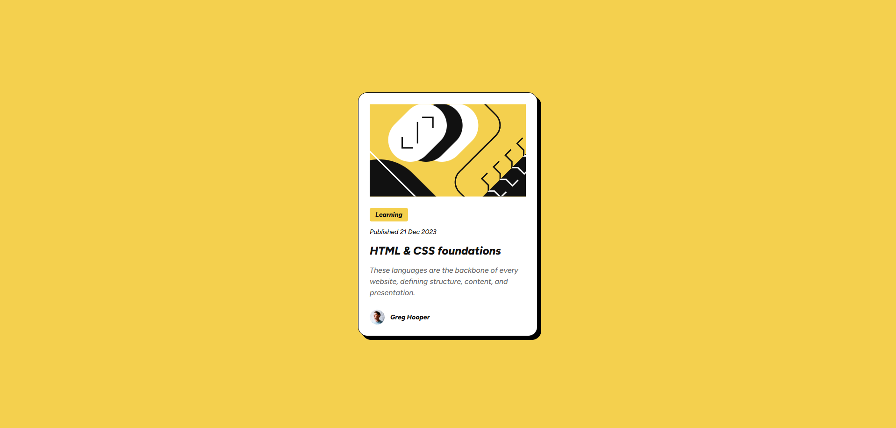
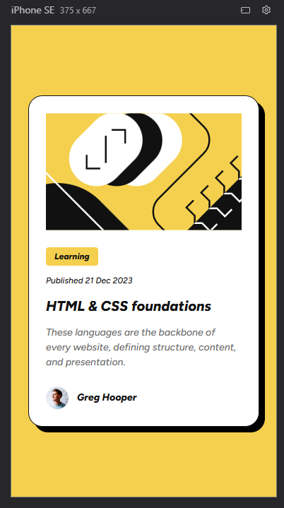

# Frontend Mentor - Blog preview card solution

This is a solution to the [Blog preview card challenge on Frontend Mentor](https://www.frontendmentor.io/challenges/blog-preview-card-ckPaj01IcS). Frontend Mentor challenges help you improve your coding skills by building realistic projects. 

## Table of contents

- [Overview](#overview)
  - [The challenge](#the-challenge)
  - [Screenshot](#screenshot)
  - [Links](#links)
- [My process](#my-process)
  - [Built with](#built-with)
  - [What I learned](#what-i-learned)
  - [Continued development](#continued-development)
  - [Useful resources](#useful-resources)
  - [AI Collaboration](#ai-collaboration)
- [Author](#author)

## Overview

### The challenge

Users should be able to:

- See hover and focus states for all interactive elements on the page

### Screenshot




### Links

- Solution URL: [Add solution URL here](https://your-solution-url.com)
- Live Site URL: [Add live site URL here](https://your-live-site-url.com)

## My process

### Built with

- Semantic HTML5 markup
- CSS custom properties
- Flexbox

### What I learned
Structuring components using semantic HTML
- Using CSS variables for colors, typography and spacing
- Creating reusable styles
- Improving accessibility with alt text and focus states
- Organizing CSS into multiple files for better scalability

Example of CSS variables used:
```:root {
  --color-yellow: hsl(47, 88%, 63%);
  --color-gray-950: hsl(0, 0%, 7%);
}
```

### Continued development

In future projects, I want to continue improving my skills with **Flexbox**. While building this project, I used Flexbox to center elements and organize the layout, but I still want to practice more complex layouts to become more comfortable with it.

I also plan to focus on writing cleaner and more maintainable **CSS**, improving how I structure my styles and components as my projects grow.

By continuing to build small projects like this, I hope to strengthen my understanding of **layout techniques and responsive design**

### Useful resources

- [MDN](https://developer.mozilla.org/) - Helped me better understand how to properly use some of the HTML tags used in this project.

### AI Collaboration

During the development of this project, I used AI tools to assist with some parts of the process.

**Tools used:**
- ChatGPT
- Claude

**How I used them:**
- Reviewing the folder structure and project organization.
- Getting suggestions to improve and refactor parts of the code.
- Clarifying questions related to HTML, CSS, and front-end project organization.

**What worked well:**
The tools were especially helpful for improving the project organization and code structure, and for quickly resolving questions during development.

**What could be improved:**
In some cases, the suggestions needed adjustments to better fit the project and the best practices I wanted to follow.

## Author

- Frontend Mentor - [@israel-monteiro](https://www.frontendmentor.io/profile/israel-monteiro)
